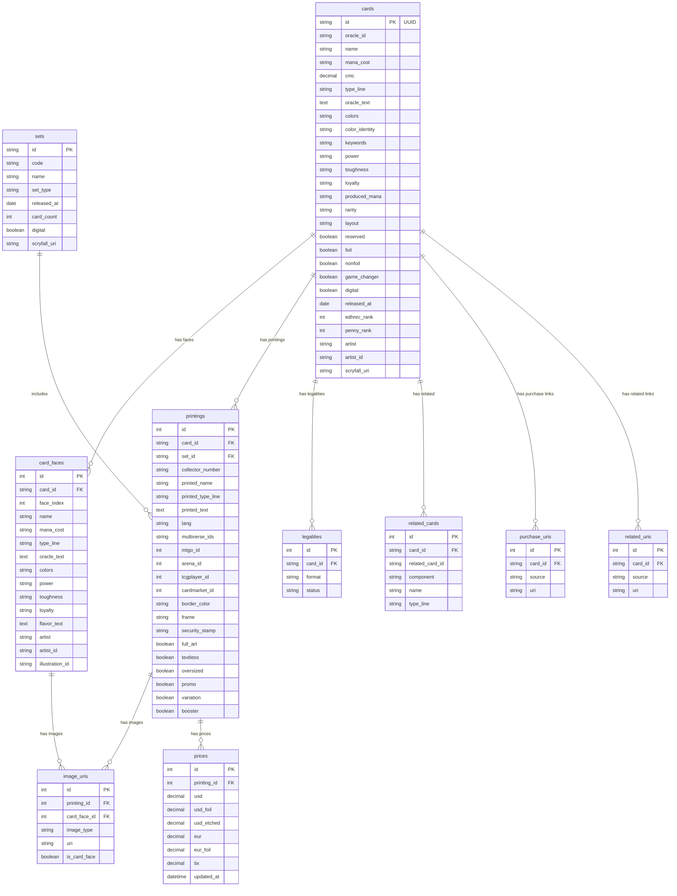

```mermaid

erDiagram

    cards ||--o{ card_faces : "has faces"
    cards ||--o{ printings : "has printings"
    cards ||--o{ legalities : "has legalities"
    cards ||--o{ related_cards : "has related"
    cards ||--o{ purchase_uris : "has purchase links"
    cards ||--o{ related_uris : "has related links"
    
    sets ||--o{ printings : "includes"
    
    printings ||--o{ image_uris : "has images"
    printings ||--o{ prices : "has prices"
    
    card_faces ||--o{ image_uris : "has images"
    
    cards {
        string id PK "UUID"
        string oracle_id
        string name
        string mana_cost
        decimal cmc
        string type_line
        text oracle_text
        string colors
        string color_identity
        string keywords
        string power
        string toughness
        string loyalty
        string produced_mana
        string rarity
        string layout
        boolean reserved
        boolean foil
        boolean nonfoil
        boolean game_changer
        boolean digital
        date released_at
        int edhrec_rank
        int penny_rank
        string artist
        string artist_id
        string scryfall_uri
    }
    
    card_faces {
        int id PK
        string card_id FK
        int face_index
        string name
        string mana_cost
        string type_line
        text oracle_text
        string colors
        string power
        string toughness
        string loyalty
        text flavor_text
        string artist
        string artist_id
        string illustration_id
    }
    
    sets {
        string id PK
        string code
        string name
        string set_type
        date released_at
        int card_count
        boolean digital
        string scryfall_uri
    }
    
    printings {
        int id PK
        string card_id FK
        string set_id FK
        string collector_number
        string printed_name
        string printed_type_line
        text printed_text
        string lang
        string multiverse_ids
        int mtgo_id
        int arena_id
        int tcgplayer_id
        int cardmarket_id
        string border_color
        string frame
        string security_stamp
        boolean full_art
        boolean textless
        boolean oversized
        boolean promo
        boolean variation
        boolean booster
    }
    
    image_uris {
        int id PK
        int printing_id FK
        int card_face_id FK
        string image_type
        string uri
        boolean is_card_face
    }
    
    related_cards {
        int id PK
        string card_id FK
        string related_card_id
        string component
        string name
        string type_line
    }
    
    prices {
        int id PK
        int printing_id FK
        decimal usd
        decimal usd_foil
        decimal usd_etched
        decimal eur
        decimal eur_foil
        decimal tix
        datetime updated_at
    }
    
    legalities {
        int id PK
        string card_id FK
        string format
        string status
    }
    
    purchase_uris {
        int id PK
        string card_id FK
        string source
        string uri
    }
    
    related_uris {
        int id PK
        string card_id FK
        string source
        string uri
    }

```